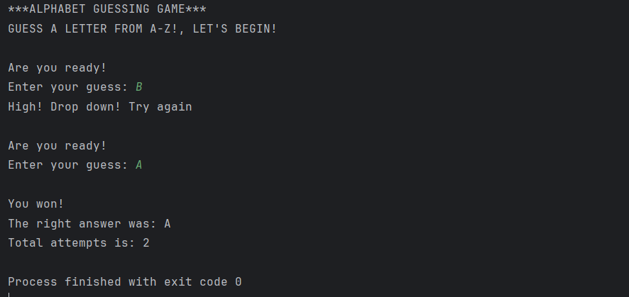

# Java-letter-guessing-game

## Overview

Java-based console game designed to demonstrate core programming concepts using Random and scanner classes for interactive letter guessing. 

This project was built to strengthen fundamental java programming concepts such as input handling, loops and random letter generation.

Problem it solves:

Beginners often struggle to apply basic programming concepts in a practical and engaging format. This project solves that by turning Java concepts into a console game that reinforces logic-building skills.

## Features 

- Random letter generation
- Allows 3 seconds before entering a guess.
- Clues of correct and incorrect guess feedback
- Displays number of attempts & the correct letter, upon completion.

  Insights:
  
  - Shows how randomness can be used in game logic
  - Tracks user performance through attempt count.

  ## Tools Used:

  - IntelliJ IDEA
  - Java
  - Random and Scanner classes
  
  ## How to play the game:

- Open the project in IntelliJ IDEA
- Run the main java file
- Enter the letter guesses in the console.

## Screenshot

